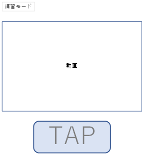
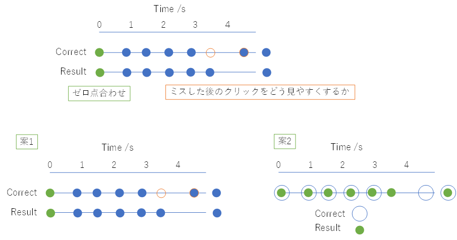
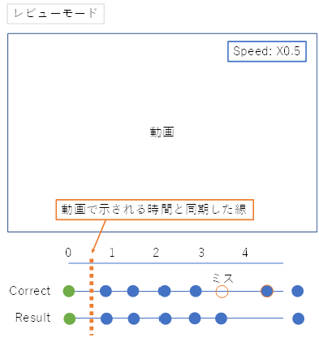
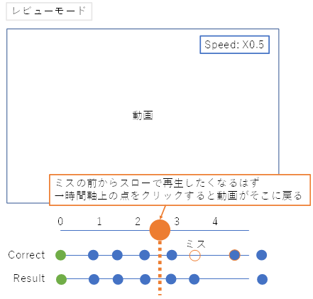

# なわとびジャッジ教育アプリ

## 最上位の目標

今までにないサービスを提供してなわとび界に貢献すること

## 解決したい課題

- 競技なわとびでレベルの高いジャッジの養成が難しい
- そもそもジャッジ自体が自分がどこまでできているか判断できない/主観的な判断しかできない

## Requirement Table

| Requirement | First Release | Future Release |
|--|--|--|
|ユーザーが適切なフィードバックを得る|MVS1||
|スピード用に使う|MVS1||
|フリースタイル用に使う|||
|ジャッジトレーニングで使える|||
|UI は英語である|PW-H2||
|練習モードはスマホで行う|MVS1||
|結果は保存できて違うタイミングでも見られる|MVS1||

MSV: minimum variable solution

||Buttons(min)|Buttons(max)|
|--|--|--|
|Speed|1 step|3 False start False switch|
|Difficulty|9 Level 0.5+1-8|<-|
|Athlete Presentation|4 Miss +/✓/-|<-|
|Routine Presentation|6 Entertainment+/✓/- Musicality +/✓/-|<-|
|Required element|4 Miss Multiple Wrap/Release Gymnastics/Power|7 Space violation Time violation Repeated Skill|

- ユーザーが行うことはおおまかに2つ
  - 練習(practice): 動画を観ながらスマホをタップしてジャッジの練習をする
    - 練習モードの時に動画を載せる必要があるか？ スマホ1台だけで練習→レビューが完結するなら載せる必要アリ

    

  - レビュー(review): 練習結果(your result)を答え(correct answer)と照らし合わせる

  

  - レビューモードの時はスローで確認したい

  
  

- ディフィカルティはフリック入力でレベル分けするとスペースを節約できるかも
- 技術的課題
  - スロー再生と追従
  - 時間軸上の任意の点にいける
- テストユーザーに使ってもらって、間違えた個所が何度かトレーニングをした後に間違えないようになるか、検証
